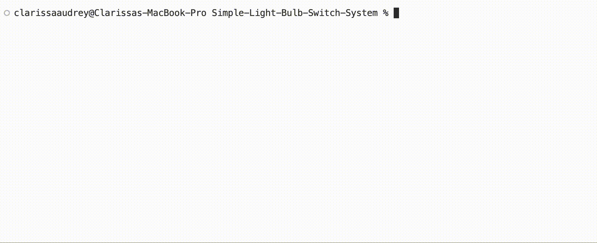

# 💡Simple Light Bulb Switch System with Finite State Machine
This repository contains a simple light bulb switch system that is designed and simulated using the concept of Finite State Machine written in C language.

> A Finite State Machine (FSM) is a machine that can, at any point in time, be in a specific state from finite set of possible states. It can move (transition) to another state by accepting an input. If the machine allows for outputs, it can produce an output.

## Short Description
The system is a light bulb circuit that is controlled by a push button. It starts off with an off light bulb, button released. When the user push the button, the light bulb turns on. Release it, it stays on. Push the button a second time, and the bulb turns off. Release the button, the light bulb stays off, going back to the reset state.

## States
The system contains four states:

- **State 1 // BULB OFF NOT PUSHED** = The reset state has the light bulb turned off and is awaiting the push of the button to turn on. The system will remain in this state as long as the button is left released. Once the button is pushed, the system is moved to state 2.

- **State 2 // BULB ON PUSHED** = This state is entered when the user has pushed the button to turn on the light bulb. When the light is turned on, the system will wait for the user to release the button. Releasing the button sends the system to state 3.

- **State 3 // BULB ON NOT PUSHED** = This state is entered when the light bulb is on with the button released. When the user pushed the button to turn the light bulb off, the system goes to state 4.

- **State 4 // BULB OFF PUSHED** = This state is entered when the user has pressed the button to turn off the light bulb. When the light bulb is turned off, the system will wait for the user to release the button. Releasing the button sends the system back to state 1.

## Input
The system has one button input that accepts either a 0 or a 1:

- **0** for not pushing button

- **1** for pushing button

## Visualization of the System
Here I provide a visualization of the system for better understanding.

#### State Diagram

#### Truth Table
From the state diagram, we can construct a truth table:

#### Karnaugh Maps
Then, from the truth table, we can construct the Karnaugh Maps for the next states and the output:

#### Combinational Boolean Equations
From each of the Karnaugh Map, we can form these equations:

## Running the Code on macOs
- #### In **Visual Studio Code (VSC)**
Type the command `make all` in VSC's terminal.

- #### In **Terminal**
Direct to the 'Simple-Light-Bulb-Switch-System' folder using `cd <folder path>`. Then, type the command `make all`.

## Workflow of the System

